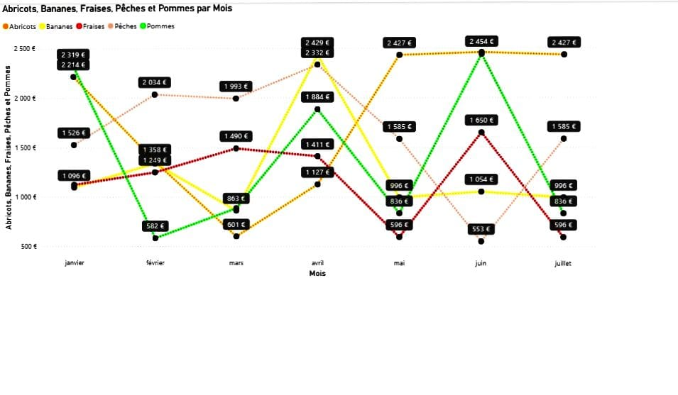

# 🍏 Analyse des ventes de fruits par mois  
### *Projet Power BI — Version Premium (Style MacOS)*

---

##  Sommaire
- [ Objectif du projet](#-objectif-du-projet)
- [ Données utilisées](#-données-utilisées)
- [Visualisation principale](#-visualisation-principale)
- [ Analyse des tendances](#-analyse-des-tendances)
- [🛠️ Méthodologie Power BI](#️-méthodologie-power-bi)
- [ Fichiers du projet](#-fichiers-du-projet)
- [Enseignements clés](#-enseignements-clés)
- [ Conclusion](#-conclusion)

---

## 🎯 Objectif du projet
Ce projet analyse l’évolution mensuelle des ventes de cinq fruits — **abricots, bananes, fraises, pêches et pommes** — afin de :

- détecter les tendances clés,  
- comprendre les variations saisonnières,  
- identifier les produits les plus performants,  
- soutenir les décisions commerciales (stocks, promotions, prévisions).

L’objectif est de fournir une vision claire, synthétique et exploitable pour la prise de décision.

---

## 📁 Données utilisées
**Période analysée : janvier → juillet**

Les données incluent :

- les montants mensuels des ventes (en euros),  
- une comparaison directe entre les cinq fruits,  
- des variations permettant d’identifier pics et baisses.

---

## 📈 Visualisation principale

Cette visualisation Power BI met en évidence :

- **Pics de ventes** : pommes en juin–juillet  
- **Baisses saisonnières** : fraises en mai–juin  
- **Stabilité** : pêches  
- **Variations fortes** : abricots entre janvier et mai  

---

## 🔍 Analyse des tendances

### 🍊 Abricots  
- Très fortes ventes en janvier (2 319 €)  
- Baisse progressive jusqu’en mai  
- Légère remontée en juin  

### 🍌 Bananes  
- Déclin entre janvier et mars  
- Reprise en avril  
- Stabilisation ensuite  

### 🍓 Fraises  
- Progression en début d’année  
- Chute marquée en mai–juin  
- Reprise légère en juillet  

### 🍑 Pêches  
- Performances élevées et régulières  
- Pic en avril (2 429 €)  
- Stabilité sur toute la période  

### 🍏 Pommes  
- Faibles ventes en février–mars  
- Forte hausse à partir d’avril  
- Meilleur fruit en juin–juillet (2 454 €)

---

## 🛠️ Méthodologie Power BI

- Importation et nettoyage des données  
- Construction d’un modèle simple (table unique)  
- Création d’un graphique en courbes multi‑catégories  
- Mise en forme visuelle (couleurs, étiquettes, titres)  
- Analyse comparative des tendances  

---

## 📦 Fichiers du projet

- `dashboard.pbix` → rapport Power BI complet  
- `images/fruits.jpeg` → graphique principal  
- `data/` (optionnel) → données sources  

---

## 🧠 Enseignements clés

- Les **pommes** dominent largement la période.  
- Les **fraises** présentent une forte saisonnalité.  
- Les **pêches** sont les plus régulières et performantes.  
- Les **abricots** chutent après un excellent mois de janvier.  
- Les **bananes** restent stables mais moins performantes.  

---

## 🏁 Conclusion

Ce projet illustre l’utilisation de Power BI pour analyser des données simples mais riches en enseignements.  
La visualisation permet d’identifier rapidement les tendances clés et d’orienter les décisions commerciales liées à la saisonnalité, aux stocks et aux stratégies de vente.

---

