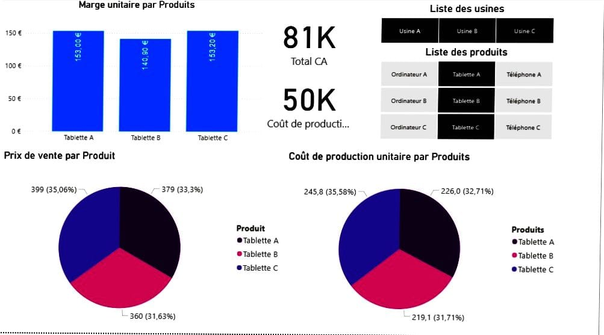

# Analyse des Marges et Coûts de Production 

Ce projet Power BI présente une analyse complète des performances financières de trois produits (Tablette A, B et C).  
L’objectif est d’évaluer la rentabilité, les marges unitaires, les coûts de production et la contribution de chaque produit au chiffre d’affaires global.

---

##  Objectifs du projet

- Visualiser les marges unitaires par produit  
- Comparer les prix de vente et les coûts de production  
- Identifier les produits les plus rentables  
- Analyser la répartition du chiffre d’affaires  
- Fournir un tableau de bord clair pour la prise de décision

---

##  Résultats clés

###  1. Marges unitaires par produit
Les marges unitaires montrent une rentabilité relativement homogène entre les trois tablettes :

- **Tablette A : 153 €**
- **Tablette B : 140,90 €**
- **Tablette C : 153,20 €**

 Les Tablettes A et C sont les plus rentables, avec une marge légèrement supérieure.

---

###  2. Chiffre d’affaires et coûts de production

- **Total CA : 81K €**  
- **Coût total de production : 50K €**

 Le projet met en évidence une marge globale positive, avec un écart significatif entre revenus et coûts.

---

###  3. Prix de vente par produit

Répartition des prix de vente :

- **Tablette A : 399 € (35,06%)**  
- **Tablette B : 379 € (33,3%)**  
- **Tablette C : 360 € (31,63%)**

 La Tablette A est le produit le plus premium, représentant la plus grande part du chiffre d’affaires.

---

###  4. Coût de production unitaire

- **Tablette A : 245,8 € (35,58%)**  
- **Tablette B : 226 € (32,71%)**  
- **Tablette C : 219,1 € (31,71%)**

 La Tablette C est la moins coûteuse à produire, ce qui explique sa marge élevée malgré un prix de vente plus bas.

---

## Dimensions disponibles dans le dashboard

- **Usines :** A, B, C  
- **Produits :** Ordinateurs, Tablettes, Téléphones (A, B, C)

Ces filtres permettent une analyse dynamique selon les sites de production et les gammes de produits.

---

##  Technologies utilisées

- **Power BI Desktop**
- DAX (mesures, calculs de marges, ratios)
- Modélisation de données
- Visualisations (bar charts, pie charts, KPI cards)

---

## Conclusion

Ce tableau de bord met en évidence la rentabilité des trois tablettes et permet d’identifier rapidement les produits les plus performants.  
Les marges unitaires, combinées aux coûts de production et aux prix de vente, offrent une vision claire pour optimiser les décisions stratégiques.

Master 2 MIASHS – Data Science & Statistiques  
Université Lumière Lyon 2
